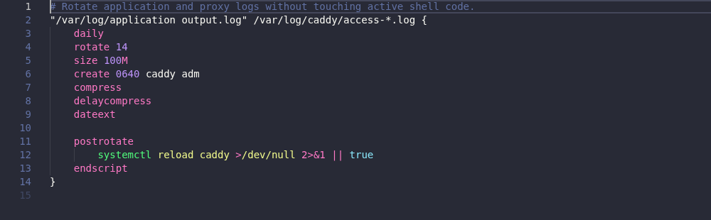

# Logrotate for Visual Studio Code

Language support for [logrotate](https://github.com/logrotate/logrotate) configuration and state
files in Visual Studio Code desktop, remote, and web extension hosts.

User documentation is available at
[willibrandon.github.io/vscode-logrotate](https://willibrandon.github.io/vscode-logrotate/). Install
the extension from the
[Visual Studio Marketplace](https://marketplace.visualstudio.com/items?itemName=willibrandon.logrotate).

**Version 0.1.9 is an early public pre-release.** The language model is currently pinned to
logrotate `3be1e9ccffe0c2245ed596183c74913d553f9f18` (3.22 and later reviewed syntax).

## Features

- Immediate TextMate syntax highlighting without extension activation.
- Dedicated highlighting for configuration files, state files, embedded shell script blocks, and
  fenced logrotate examples in Markdown.
- An error-tolerant, lossless TypeScript parser with diagnostics, completion, hover, signature help,
  symbols, folding, selection ranges, links, references, semantic tokens, safe code actions, and
  formatting.
- The same language core and LSP behavior on desktop and in a browser Worker.
- Bounded include analysis through VS Code's filesystem API, including virtual workspaces.
- Optional host validation with an installed `logrotate` executable. This is off by default and
  available only for saved local files in trusted desktop workspaces.

The extension never executes `prerotate`, `postrotate`, `firstaction`, `lastaction`, or `preremove`
scripts. Its formatter preserves the raw bytes of script bodies and does not reorder directives.

## Preview



The grammar uses standard, theme-neutral TextMate scopes. The reproducible
[theme smoke check](docs/theme-smoke.md) also covers high contrast and three popular third-party
themes.

## Recognized files

The extension intentionally uses narrow defaults:

- `logrotate.conf`
- files directly under a `logrotate.d` directory
- `*.logrotate` and `*.logrotate.conf`
- open text files whose first line is a complete absolute or tilde-prefixed log-path stanza
- files resolved through an `include` directive from an open root configuration
- `logrotate.status`
- `logrotate/status`
- state files whose first line is `logrotate state -- version 1` or `logrotate state -- version 2`

It does not claim every `.conf`, `.status`, or file named `status`. Associate an unusual project
filename using VS Code's built-in setting:

```json
{
  "files.associations": {
    "deploy/rotation-policy": "logrotate"
  }
}
```

Markdown fences named `logrotate`, `logrotate.conf`, and `logrotate-config` are highlighted:

````markdown
```logrotate
/var/log/application.log {
  weekly
  rotate 4
  compress
}
```
````

## Settings

| Setting                             | Default     | Purpose                                                           |
| ----------------------------------- | ----------- | ----------------------------------------------------------------- |
| `logrotate.validation.enable`       | `true`      | Enable built-in syntax and semantic diagnostics.                  |
| `logrotate.validation.maxProblems`  | `100`       | Limit diagnostics for a malformed document.                       |
| `logrotate.targetVersion`           | `latest`    | Select `latest`, safe `auto`, or an explicitly supported version. |
| `logrotate.externalValidation.mode` | `off`       | Optionally validate with the installed binary on save.            |
| `logrotate.executablePath`          | `logrotate` | Installed executable used by trusted desktop validation.          |
| `logrotate.trace.server`            | `off`       | Set LSP protocol trace detail for deep troubleshooting.           |

Internal validation models the reviewed logrotate language. Optional installed validation uses
`logrotate --debug` and reflects the current host's version, filesystem, accounts, build options,
and include graph. It is a secondary opinion, not the extension parser or formatter.

The `auto` target runs only `logrotate --version`, and only in a trusted local desktop extension
host. Browser, virtual, untrusted, unavailable, failed, or unsupported detections safely use the
latest reviewed language model instead.

## Supported logrotate versions

| Target   | Built-in language model                                                     |
| -------- | --------------------------------------------------------------------------- |
| `latest` | Newest reviewed syntax; currently logrotate 3.22.                           |
| `auto`   | Detect 3.22 on an eligible host, otherwise safely use the `latest` model.   |
| `3.22`   | Pin diagnostics and completion to the reviewed logrotate 3.22 syntax model. |

Installed validation is optional and may run against a newer host binary, but its findings remain
clearly labeled as host-specific and never replace the built-in parser or formatter.

## Commands

- **Logrotate: Validate Current File with Installed Logrotate**
- **Logrotate: Restart Language Server**
- **Logrotate: Show Language Server Output**
- **Logrotate: Open Directive Documentation**

Installed validation explains why it is unavailable for an unsaved or virtual file, an untrusted
workspace, or a browser extension host.

The **Logrotate Language Server** output channel records extension and server startup, analyzed
document URIs and versions, diagnostic and include counts, configuration changes, restarts, closes,
and failures. Default info logs never include document contents. Explicit protocol tracing can
include document contents, so enable it only while troubleshooting.

## Workspace trust and privacy

Built-in parsing works in Restricted Mode. Executable settings and installed validation are
restricted and checked again immediately before process creation. Browser and virtual workspaces
retain internal language features but cannot run a host executable.

Version 1 has no telemetry and makes no runtime network requests. Documentation links open only
after an explicit user action.

## Troubleshooting

- If an unusual standalone filename is plain text, confirm the language mode in the status bar and
  add the narrow `files.associations` entry shown above. Files actually resolved through an
  `include` directive are assigned the Logrotate language when resolved from an open root.
- Run **Logrotate: Show Language Server Output** to inspect sanitized startup, analysis, and failure
  logs. Enable `logrotate.trace.server` only temporarily because protocol traces can include text.
- Run **Logrotate: Restart Language Server** after changing extension-host or remote filesystem
  state. Restarting disposes the previous server and loaded-resource watchers first.
- If installed validation is unavailable, save the file and confirm that it is a local `file:` URI,
  the workspace is trusted, the desktop host can find `logrotate`, and validation is enabled.
  Browser and virtual workspaces intentionally cannot start it.

## Development

### Development container

The [development container](docs/development-container.md) is the recommended setup. On the host,
install Docker with a Linux container engine, Visual Studio Code, and the current Dev Containers
extension. Run **Dev Containers: Rebuild and Reopen in Container**. Container creation installs both
npm lockfiles and prepares the pinned logrotate source corpus.

Run these commands in the container:

```sh
node --version
npm --version
npm ci
npm run verify
```

The first two commands must report `v24.19.0` and `12.0.2`. Run the complete container check before
submitting a change:

```sh
bash .devcontainer/verify.sh
```

It validates every required tool and runs the upstream, installed-logrotate, unit, coverage,
performance, desktop, web, packaged VSIX, Remote SSH, theme, and documentation checks.

### Host setup

Development without the container requires:

- Node.js 24 LTS
- npm 12 (the exact package manager version is recorded in `package.json`)
- Git for Windows, including Git Bash, when developing on native Windows
- Chromium and Xvfb for web and headless desktop integration tests on Linux
- logrotate 3.22 for installed-tool tests
- Docker and OpenSSH for the isolated Remote SSH smoke test

```sh
nvm install
nvm use
npm ci
npm run verify
```

On native Windows, `npm config get os` must print `null`. If it prints `linux`, remove the stale
override and reinstall the platform-specific packages from the committed lockfile:

```cmd
npm config delete os --location=user
npm config delete os --location=global
git restore package-lock.json
rmdir /s /q node_modules
npm ci
```

Useful focused commands:

```sh
npm run check:generated
npm run lint
npm run typecheck
npm test
npm run test:grammar
npm run test:lsp
npm run test:integration
npm run test:web
npm run test:vsix
npm run test:remote
npm run capture:themes
npm run build
npm run package
```

`npm run test:web` downloads and starts the VS Code web test host. VS Code may print transient
filesystem-provider and built-in extension warnings during startup; a successful run ends with
`VS Code web extension tests passed.` `npm run test:vsix` is self-contained: it builds the VSIX,
verifies its checksum, installs it into clean desktop and browser hosts, and runs both smoke tests.
`npm run test:remote` also builds the VSIX, then runs VS Code locally against an ephemeral Linux
container over SSH. Native Windows works with Docker Desktop in Linux containers mode;
`docker info --format "{{.OSType}}"` must print `linux`. The command also requires `ssh` and
`ssh-keygen` on PATH.

The repository uses native TypeScript 7 for compilation. TypeScript 6 is installed only as the
compatibility API consumed by typed ESLint while TypeScript 7.0 has no programmatic compiler API.
Runtime code uses ESM source, strict host-specific projects, npm workspaces, and four independent
esbuild outputs:

```text
packages/language-core   pure host-independent language implementation
packages/language-server shared handlers plus Node and Worker adapters
packages/vscode-client   desktop and browser clients and filesystem bridge
data                     reviewed directive and version source of truth
syntaxes                 generated TextMate grammars
test                     grammar, architecture, package, and host-level tests
```

`data/directives.yaml` generates the grammar keyword expression, completion and hover tables,
semantic metadata, snippets, and [directive reference](docs/directives.md). Run `npm run generate`
only after reviewed data changes and commit every generated consumer. `npm run check:generated`
rejects drift.

The complete product and technical rationale is in [docs/design.md](docs/design.md).

## Status and contributing

Version 0.1.9 continues the public pre-release period before stable 1.0. Contributions should
preserve browser/desktop parity, lossless script bodies, conservative diagnostics, bounded resource
use, and generated language-data consistency. See [CONTRIBUTING.md](CONTRIBUTING.md),
[SECURITY.md](SECURITY.md), and the [release checklist](docs/release-checklist.md).

This project is distributed under the [MIT License](LICENSE) and publishes as
`willibrandon.logrotate`.
