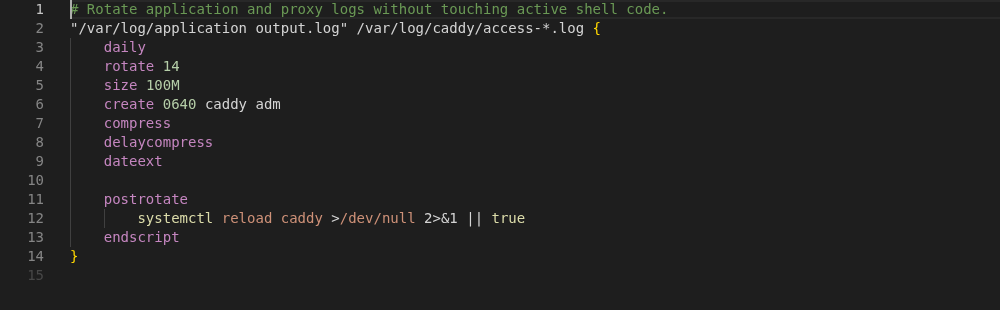

Logrotate adds language-aware editing for logrotate configuration and state files in Visual Studio
Code. Highlighting appears as soon as a recognized file opens. Diagnostics, completion, hover,
navigation, and formatting follow when the language server starts.

## Start editing

[Install Logrotate from the Visual Studio Marketplace](https://marketplace.visualstudio.com/items?itemName=willibrandon.logrotate),
then open a configuration file. A local logrotate installation is not required for normal editing.

The extension understands includes, script blocks, state files, and the syntax reviewed for
logrotate 3.22. It works in local, remote, virtual, and browser workspaces where the corresponding
Visual Studio Code feature is available.

## Safety

The extension does not rotate logs or run configuration scripts. Formatting preserves script bodies
and does not reorder directives.

[Start with a configuration file](./getting-started/) or read how
[files are recognized](./recognized-files/).
