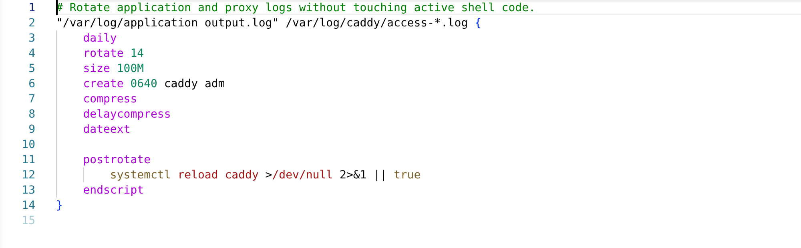
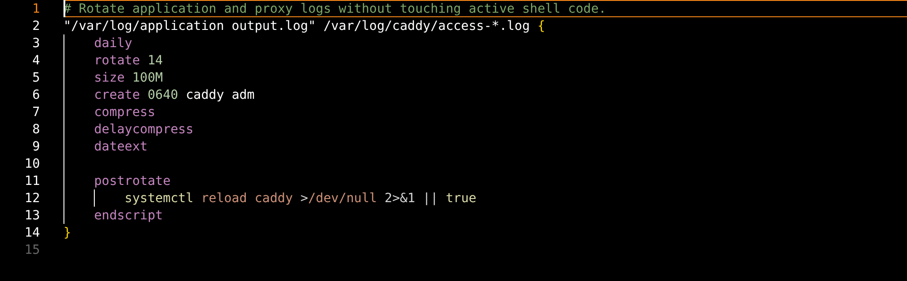
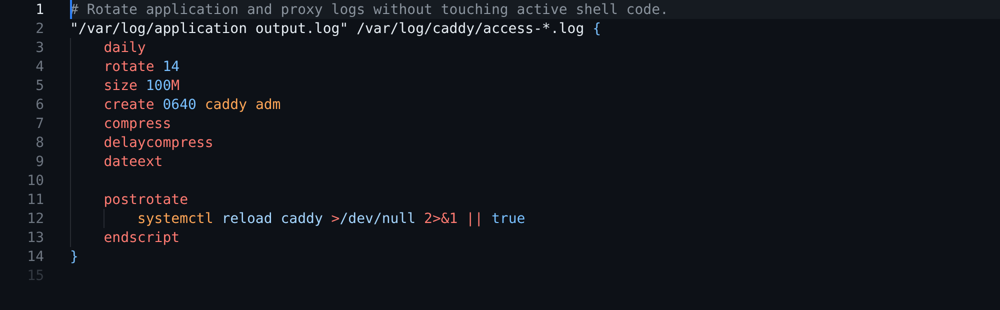
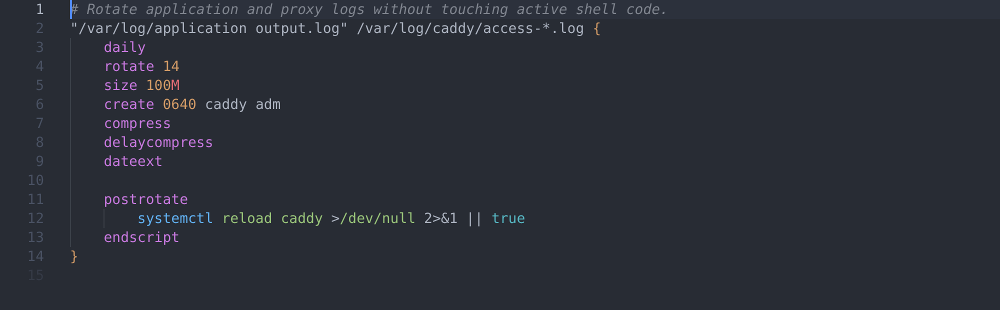

# Theme and accessibility smoke check

Logrotate syntax uses standard TextMate and semantic-token classifications without hard-coded
colors. `npm run capture:themes` opens the real extension in VS Code for the Web, loads the fixture
at `test/fixtures/workspace/theme-preview.logrotate`, selects each theme through VS Code, and saves
headless Chromium screenshots.

Screenshots are captured at 2× device scale so they remain sharp on high-density displays.

The 2026-08-12 review used VS Code 1.132.1 and checked that comments remain legible; paths,
directives, numbers, modes, users, and groups remain distinguishable; braces stay structural; and
the embedded script region follows shell highlighting.

| Theme               | Evidence                                        |
| ------------------- | ----------------------------------------------- |
| Dark+               |                   |
| Light+              |                 |
| Dark High Contrast  |  |
| GitHub Dark Default |           |
| Dracula Theme       |                   |
| One Dark Pro        |         |

These screenshots are human-review evidence, not pixel-golden tests. Exact-position grammar tests
remain the automated correctness gate so harmless theme or editor rendering changes do not make CI
flaky.
